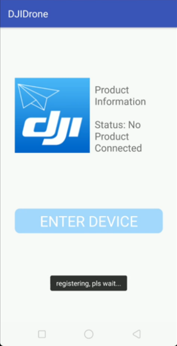
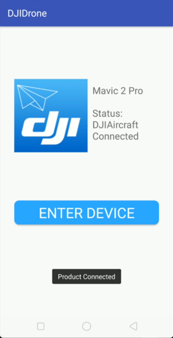
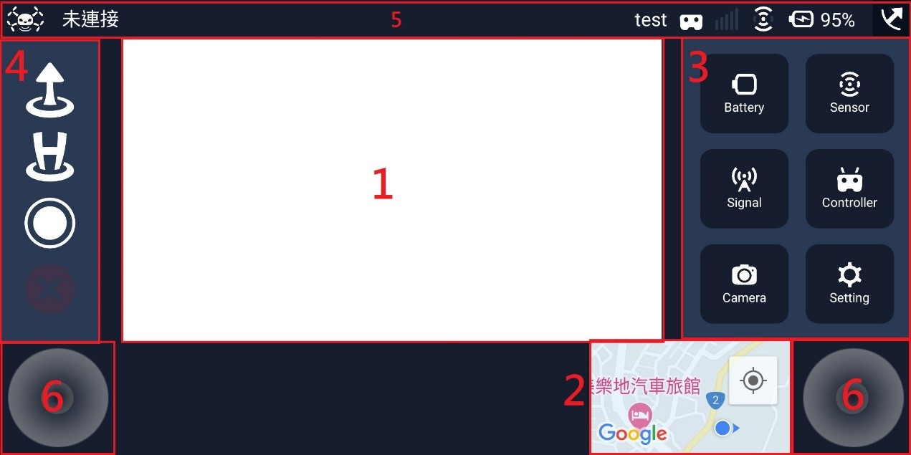
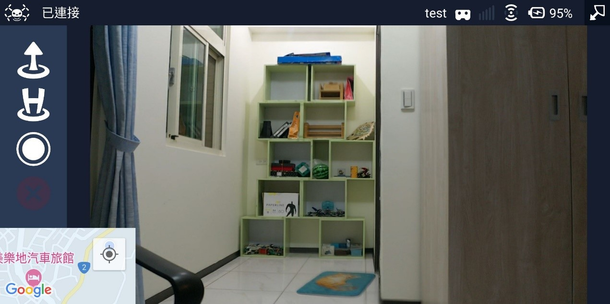
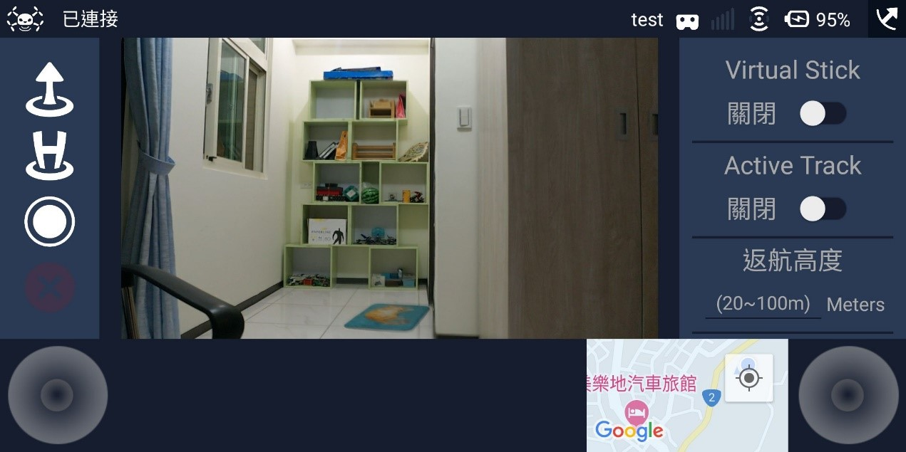

# DJIDrone
可以丟東西上來
Grotion Good

---
## Login Page

登入頁面：在連結至無人機後可以進入主畫面

&#8195

## Main Page

主畫面：設有無人機畫面(1)、地圖(2)、無人機設定(3)、起飛降落(4)、無人機資訊(5)以及虛擬搖桿(6)

大螢幕：點選右上角可以隱藏或顯示設定欄以及虛擬搖桿

  

## Other

Live Stream以及Web Socket：開關Live Stream以及Web Socket，開啟後可以與桌機進行溝通與傳輸

Virtual Stick以及Activate Track：開啟Virtual Stick可以使用螢幕上的搖桿操作無人機；開啟

---
## Related Link

- [Trello](https://trello.com/b/g2b13Jtw)
---
## Google 共同帳號
帳號|密碼|
--------- | --------|
ntoucomputerprojectdrone@gmail.com  | djidrone123 |

api版本>23
